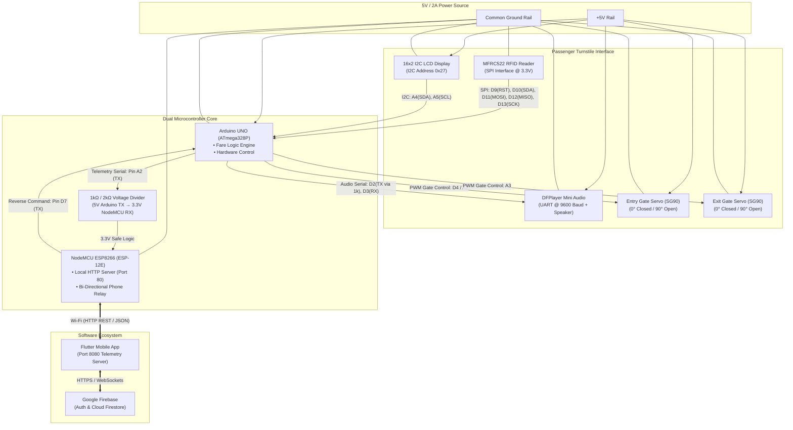

# Smart Bus Hardware Pinout & Wiring Specification

This document provides the complete hardware wiring, pin assignments, and voltage level interface specifications for the **Smart Bus IoT Prototype** (Arduino UNO + NodeMCU ESP8266 + DFPlayer Mini + MFRC522 RFID + SG90 Servos + 16x2 I2C LCD).

---

## 1. System Architecture Diagram



---

## 2. Complete Pin Assignment Table

### A. Arduino UNO (Master Controller)

| Arduino Pin | Connected Component | Component Pin | Signal Type | Electrical Notes |
| :--- | :--- | :--- | :--- | :--- |
| **3.3V** | MFRC522 RFID Reader | 3.3V (VCC) | Power Output | **NEVER connect RFID VCC to 5V!** |
| **5V** | 16x2 LCD, Servos, DFPlayer | VCC | Power Output | Shared regulated 5V power bus |
| **GND** | All Peripherals & NodeMCU | GND | Ground | Common system ground rail |
| **D2** | DFPlayer Mini | RX | SoftwareSerial TX | Driven via 1kΩ series current-limiting resistor |
| **D3** | DFPlayer Mini | TX | SoftwareSerial RX | Direct 3.3V logic to Arduino digital input |
| **D4** | Entry Turnstile Servo (SG90) | Orange / PWM | Servo Pulse | Gate turnstile: 0° (Closed) / 90° (Open) |
| **D5** | DC Motor Driver (L293D / Relay) | IN1 / Forward | Digital Output | Transit movement simulation |
| **D6** | DC Motor Driver (L293D / Relay) | IN2 / Reverse | Digital Output | Transit movement simulation |
| **D9** | MFRC522 RFID Reader | RST | SPI Reset | Hardware reset line |
| **D10** | MFRC522 RFID Reader | SDA / SS | SPI Chip Select | Slave Select line |
| **D11** | MFRC522 RFID Reader | MOSI | SPI Data In | Master Out, Slave In |
| **D12** | MFRC522 RFID Reader | MISO | SPI Data Out | Master In, Slave Out |
| **D13** | MFRC522 RFID Reader | SCK | SPI Clock | Serial Clock |
| **A0** | START Push Button | Terminal 1 | Digital Input (PULLUP)| Button connects Pin A0 to GND |
| **A1** | STOP Push Button | Terminal 1 | Digital Input (PULLUP)| Button connects Pin A1 to GND |
| **A2** | NodeMCU ESP8266 | Pin D2 (GPIO 4) | Serial Telemetry TX | **Must pass through 1kΩ / 2kΩ voltage divider** |
| **A3** | NodeMCU ESP8266 | Pin D7 (GPIO 13) | Reverse Signal RX | Receives wallet recharge & card unblock pulses |
| **A4** | 16x2 I2C LCD | SDA | I2C Serial Data | Hardware I2C line |
| **A5** | 16x2 I2C LCD | SCL | I2C Serial Clock | Hardware I2C line |

---

### B. NodeMCU ESP8266 (IoT Cloud & Mobile Bridge)

| NodeMCU Pin | Connected Device | Signal Type | Description |
| :--- | :--- | :--- | :--- |
| **VIN / 5V** | External 5V Power Supply | Power In | Regulated 5V DC input |
| **GND** | System Ground Rail | Ground | Common reference with Arduino UNO |
| **D2 (GPIO 4)**| Arduino Pin A2 via Divider | Serial In (RX) | 9600 Baud telemetry listener (`CARD_TAP`, `FARE_DEDUCT`, `STOP_REACHED`) |
| **D7 (GPIO 13)**| Arduino Pin A3 | Serial Out (TX) | 9600 Baud reverse commands (instant card recharge / unblock) |
| **D5 (GPIO 14)**| Green LED (+) via 220Ω | Digital Out | Authorized boarding / Gate open indicator |
| **D6 (GPIO 12)**| Red LED (+) via 220Ω | Digital Out | Insufficient balance / Card blocked warning |

---

## 3. Critical Voltage Divider Circuit (5V to 3.3V)

The Arduino UNO outputs 5V TTL logic, while the ESP8266 GPIO pins are strictly 3.3V tolerant. Directly wiring Arduino A2 to NodeMCU D2 can degrade the ESP8266 chip over time. A simple two-resistor voltage divider is implemented:

```text
Arduino Pin A2 (5V Signal)
         │
       [1 kΩ]
         │
         ├───► To NodeMCU Pin D2 (3.3V Safe Input)
         │
       [2 kΩ]
         │
    Common Ground
```

$$	ext{Output Voltage} = 5	ext{V} 	imes rac{2	ext{k}\Omega}{1	ext{k}\Omega + 2	ext{k}\Omega} = 5	ext{V} 	imes 0.667 pprox 3.33	ext{V}$$

---

## 4. DFPlayer Mini Audio File Structure

The micro-SD card formatted in FAT32 contains bilingual sound tracks divided into folders:

* **Folder `/01` (Kannada Announcements - ಕನ್ನಡ)**:
  * `001.mp3`: "ಸ್ಮಾರ್ಟ್ ಬಸ್ ಸೇವೆಗೆ ಸ್ವಾಗತ" (Welcome to Smart Bus service)
  * `002.mp3`: "ದಯವಿಟ್ಟು ನಿಮ್ಮ ಸ್ಮಾರ್ಟ್ ಕಾರ್ಡ್ ಸ್ಪರ್ಶಿಸಿ" (Please tap your card)
  * `003.mp3`: "ಪ್ರವೇಶ ಯಶಸ್ವಿ, ಶುಭ ಪ್ರಯಾಣ" (Entry successful, happy journey)
  * `004.mp3`: "ನಿರ್ಗಮನ ಯಶಸ್ವಿ, ಶುಲ್ಕ ಕಡಿತವಾಗಿದೆ" (Exit successful, fare deducted)
  * `005.mp3`: "ಅಮಾನ್ಯ ಕಾರ್ಡ್, ದಯವಿಟ್ಟು ಪುನಃ ಪ್ರಯತ್ನಿಸಿ" (Invalid card, please try again)
  * `006.mp3`: "ಕಡಿಮೆ ಬ್ಯಾಲೆನ್ಸ್, ದಯವಿಟ್ಟು ರೀಚಾರ್ಜ್ ಮಾಡಿ" (Insufficient balance, please recharge)
  * `011.mp3` - `028.mp3`: Stop announcements for 18 Bengaluru stops in Kannada.

* **Folder `/02` (English Announcements)**:
  * `001.mp3`: "Welcome aboard the Smart Bus transit system."
  * `002.mp3`: "Please tap your smart card on the reader."
  * `003.mp3`: "Entry successful. Barrier open. Welcome aboard."
  * `004.mp3`: "Exit recorded. Thank you for travelling with us."
  * `005.mp3`: "Invalid card or card blocked. Access denied."
  * `006.mp3`: "Insufficient balance. Minimum balance is Rupees 10."
  * `011.mp3` - `028.mp3`: Next stop announcements for stops S01 to S18 in English.
