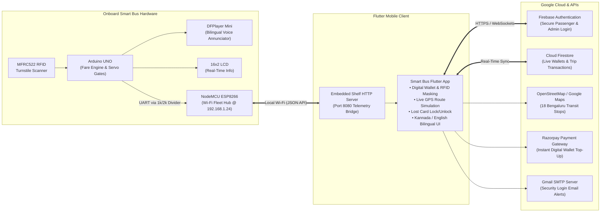
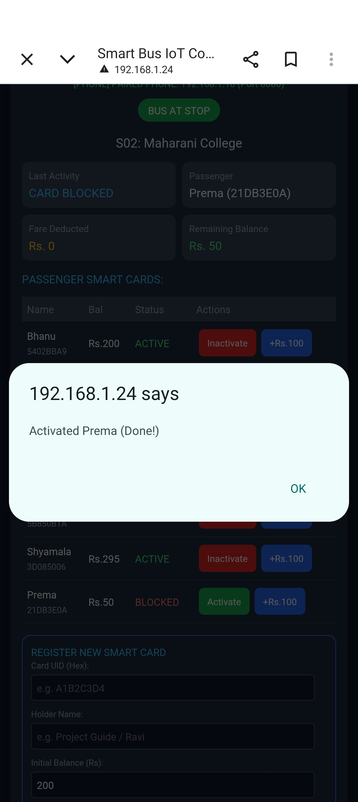
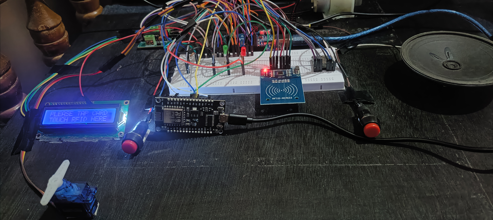
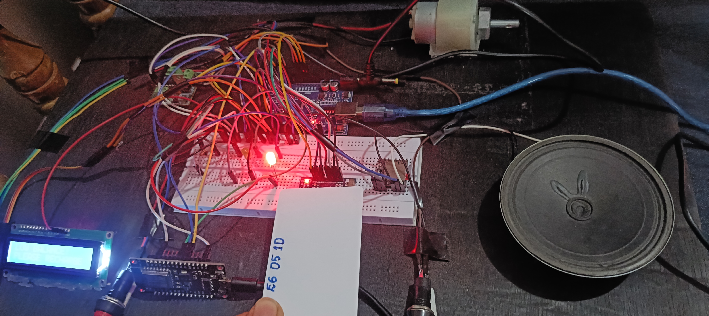

# Smart Bus – IoT-Based Smart Bus Fare Collection and Real-Time Tracking with Flutter Application

[](https://flutter.dev)
[](https://dart.dev)
[](https://firebase.google.com)
[](https://arduino.cc)
[](https://espressif.com)
[](https://razorpay.com)

> **MCA Major / Final Year Degree Thesis Project**  
> **Author:** [Gagana C P](https://github.com/gaganagana) (Reg No. P18MC22S0012)  
> **Project Guide:** Mrs. Ashwini D N, Assistant Professor, Department of MCA  
> **Institution:** Community Institute of Management Studies, Bengaluru (Affiliated to Bengaluru City University)

---

## 1. Executive Summary & Architecture

The **Smart Bus** transit ecosystem is a multi-tier Internet of Things (IoT) public transportation management platform designed to replace cash and paper ticketing with a modern, contactless, and cloud-synchronized transit experience.

The system tightly couples physical microcontroller hardware (Arduino UNO + NodeMCU ESP8266) with a reactive cross-platform Flutter mobile application and Google Firebase cloud backend:



---

## 2. Key Engineering Innovations

### A. Dual-Microcontroller Telemetry Bridge
* **Arduino UNO (ATmega328P):** Manages high-precision time-critical hardware tasks: 13.56 MHz RFID smart card polling, dual SG90 turnstile servo gating, L293D motor progression, and bilingual audio announcements.
* **NodeMCU ESP8266:** Runs an autonomous HTTP web server (`http://192.168.1.24`) linked over a 1kΩ / 2kΩ voltage-divided serial bus (Arduino A2 to NodeMCU D2). Forwards real-time card tap events directly to the smartphone application and Google Firebase.

### B. Flutter Cross-Platform Mobile Application
* **Provider State Management:** Clean, reactive state lifecycle tracking passenger card balances, onboard states, bus speed, current stop, and notification logs.
* **Embedded Shelf HTTP Server:** The Flutter mobile application runs an in-app HTTP listener on port 8080, receiving live card events and stop updates directly from the NodeMCU without requiring an external intermediate cloud server during transit.
* **Bilingual UI (English & Kannada - ಕನ್ನಡ ಇಂಟರ್ಫೇಸ್):** Complete internationalization (`app_en.arb` and `app_kn.arb`) enabling commuters to navigate routes, examine trip logs, and receive audio announcements in regional Kannada.
* **Card Security & Digital Wallet:** Commuters can immediately lock lost or stolen cards with a single tap, dynamically preventing turnstile gate access on the physical bus.
* **Fintech Wallet Recharge:** Integrated Razorpay test payment gateway supporting UPI, Netbanking, and Credit/Debit cards with instant balance updates and in-app SMS confirmation.
* **Security Alerts via SMTP:** Automatically sends email alerts via Gmail SMTP to commuter smartphones whenever a new dashboard login or high-value transaction occurs.

---

## 3. Screenshots Gallery

### A. Authentication & Fleet Management
| 01. Login Screen | 02. Commuter Registration | 03. Mobile Login Alert |
| :---: | :---: | :---: |
|  |  |  |
| *Role-based sign in (Admin & Passenger)* | *Commuter self-registration & RFID UID binding* | *Instant security login alert email received on phone* |

| 04. Admin Fleet Control Room | 05. Commuter Directory | 06. RFID Wallets Management |
| :---: | :---: | :---: |
|  |  |  |
| *Live bus speed, stop, occupancy (4/40), and traffic status* | *Searchable passenger database with balances* | *Active RFID cards, UID mapping, and balance monitoring* |

---

### B. Passenger Experience & Live Transit Tracking
| 07. Passenger Dashboard | 08. Live Route Map Tracking | 09. Trip & Fare History |
| :---: | :---: | :---: |
|  |  |  |
| *Live balance (₹195), card status, and lock/unlock toggle* | *Live route progression across 18 Bengaluru stops* | *Stop-by-stop journey audit with dynamic fare deduction* |

---

### C. Regional Bilingual Interface (Kannada UI - ಕನ್ನಡ ಇಂಟರ್ಫೇಸ್)
| 10. ಕನ್ನಡ ಪ್ರಯಾಣಿಕ ಡ್ಯಾಶ್‌ಬೋರ್ಡ್ | 11. ಲೈವ್ ಬಸ್ ಸ್ಥಿತಿ ಮತ್ತು ವೇಗ | 12. ಬಿಎಂಟಿಸಿ ಮಾರ್ಗ ಸಹಾಯಕಿ |
| :---: | :---: | :---: |
|  |  |  |
| *ಕನ್ನಡ ಸ್ಥಳೀಕರಣ: ಸ್ಮಾರ್ಟ್ ಕಾರ್ಡ್ ವಿವರಗಳು ಮತ್ತು ಬ್ಯಾಲೆನ್ಸ್* | *ಬಸ್‌ನ ಪ್ರಸ್ತುತ ನಿಲ್ದಾಣ, ವೇಗ ಮತ್ತು ಮುಂದಿನ ನಿಲ್ದಾಣ* | *ಬಿಎಂಟಿಸಿ ಬಸ್ ಮಾರ್ಗಗಳ ಮಾಹಿತಿ (600F, 500D, 335E)* |

---

### D. Fintech Wallet Recharge & Telemetry Hub
| 13. Razorpay Payment Gateway | 14. Recharge Success SMS | 15. NodeMCU IoT Fleet Hub |
| :---: | :---: | :---: |
|  |  |  |
| *Secure top-up via UPI, Netbanking, and Cards* | *Instant in-app SMS notification confirming recharge* | *Hardware controller web console (IP: 192.168.1.24)* |

---

### E. Physical Hardware Prototype
| 16. Prototype Bus Chassis | 17. Dual Turnstiles & RFID Reader | 18. Integrated Benchtop Rig |
| :---: | :---: | :---: |
|  |  |  |
| *Scale bus chassis with DC motor drive* | *Servo-actuated gate barrier with RFID card reader* | *Complete breadboard assembly during live testing* |

---

## 4. Hardware Pinout & Wiring Specifications

Detailed pin tables, voltage divider calculations, and audio folder structures are documented in [`Circuit/Pinout_and_Wiring_Guide.md`](Circuit/Pinout_and_Wiring_Guide.md).

---

## 5. Software Setup & Installation Guide

### Prerequisites
* **Flutter SDK:** Version 3.3.0 or higher ([Installation Guide](https://docs.flutter.dev/get-started/install))
* **Dart SDK:** Version 3.3.0 or higher
* **Arduino IDE:** Version 2.x with ESP8266 board support installed

### Running the Flutter Mobile App
```bash
# Navigate to the Flutter project directory
cd Main-Project/Smart-Bus-IoT-Fare-Collection/Flutter-App

# Fetch dependencies
flutter pub get

# Generate bilingual localization files
flutter gen-l10n

# Run on connected smartphone or emulator
flutter run
```

### Flashing Hardware Firmware
1. Open [`Arduino/SmartBus_Arduino_Firmware.ino`](Arduino/SmartBus_Arduino_Firmware.ino) in Arduino IDE. Select **Board: Arduino Uno**, Port, and click **Upload**.
2. Open [`Arduino/SmartBus_NodeMCU_Firmware.ino`](Arduino/SmartBus_NodeMCU_Firmware.ino). Update `WIFI_SSID` and `WIFI_PASSWORD` with your local network credentials. Select **Board: NodeMCU 1.0 (ESP-12E Module)**, Port, and click **Upload**.

---

## 6. Official Academic Documentation

The complete MCA Major Project Thesis submitted to Bengaluru City University is preserved in [`Documentation/Smart_Bus_Major_Project_Report.docx`](Documentation/Smart_Bus_Major_Project_Report.docx).
