# Smart Bus – IoT Fare Collection and Real-Time Tracking with Flutter Application

> **MCA Major (Final Year) Project**  
> **Student:** Gagana C P  
> **Project Guide:** Mrs. Ashwini D N, Assistant Professor, Department of MCA  
> **Institution:** Community Institute of Management Studies, Bengaluru (Affiliated to Bengaluru City University)  

---

## About This Project

I developed this project as my final MCA major project. It builds on my earlier minor project by connecting the physical bus hardware to a cross-platform Flutter mobile application and Firebase over Wi-Fi.

While my minor project proved that RFID ticketing works on an Arduino, in the real world commuters need a mobile app to check their card balance, lock lost cards, top up their wallet, and track bus stops. This project connects the physical bus turnstile with a mobile app so both passengers and admins can manage transit data easily.

---

## What I Worked On

* **Hardware & Arduino Code:** Connected the Arduino UNO (handling RFID scanning, DFPlayer voice announcements, and servo turnstile gates) to a NodeMCU ESP8266 over a serial link.
* **Voltage Divider Protection:** Because the Arduino outputs 5V signals and the ESP8266 only tolerates 3.3V, I built a 1kΩ / 2kΩ resistor voltage divider between Arduino Pin A2 (TX) and NodeMCU Pin D2 (RX) to protect the Wi-Fi chip.
* **Flutter Mobile Application:** Built a cross-platform Flutter app with screens for passenger login, card status, live balance, transaction history, and an interactive bus route map.
* **Wi-Fi Telemetry Server:** The NodeMCU runs a small web server on the local network (192.168.1.24) and relays card events to an embedded Shelf HTTP server running inside the Flutter app on port 8080.
* **Bilingual Support (English & Kannada):** Added full regional Kannada (ಕನ್ನಡ) and English localization for both the mobile application and the DFPlayer audio tracks.
* **Card Security (Lock / Unlock):** Built a toggle in the app so passengers can lock a lost RFID card, which stops the turnstile gate from opening on the bus.
* **Test-Mode Wallet Top-Up:** Integrated the Razorpay payment gateway in test/sandbox mode so users can test topping up their card balance.
* **Login Security Alerts:** Configured Gmail SMTP to automatically email passengers whenever a new login to their dashboard is recorded.

---

## Honest Notes on Project Scope

* **Bus Tracking:** Bus movement is simulated step-by-step through 18 predefined Bengaluru stops (Kempegowda BS, Maharani College, Corporation, etc.) rather than using a physical GPS receiver module.
* **Payment Gateway:** Razorpay is integrated in test/sandbox mode for demonstration; no real-money transactions are processed.
* **SMS Alerts:** Alerts are displayed as in-app notification banners; they are not connected to a paid commercial SMS gateway.

---

## Technologies Used

* **Mobile App:** Flutter 3.x, Dart, Provider (state management), Shelf (embedded HTTP server), Google Maps / OpenStreetMap
* **Cloud & Auth:** Firebase Authentication, Cloud Firestore
* **Hardware:** Arduino UNO, NodeMCU ESP8266, MFRC522 RFID (13.56 MHz), DFPlayer Mini + Speaker, 16x2 I2C LCD, SG90 Servos
* **Languages:** Dart, Embedded C / C++, HTML/CSS

---

## Mobile Application Screenshots

### 1. Login & Commuter Registration
| Login Screen | Commuter Registration | Login Email Notification |
| :---: | :---: | :---: |
| 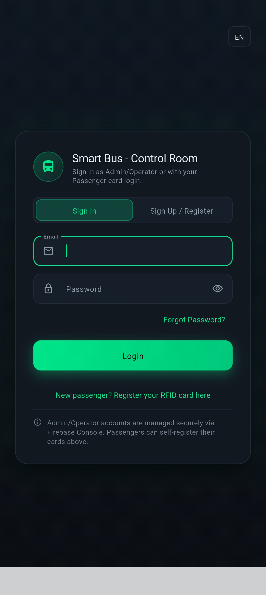 | 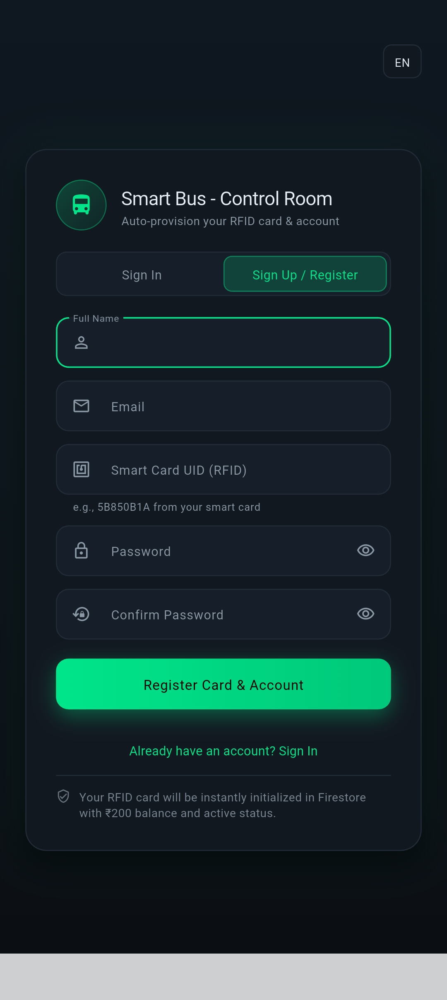 | 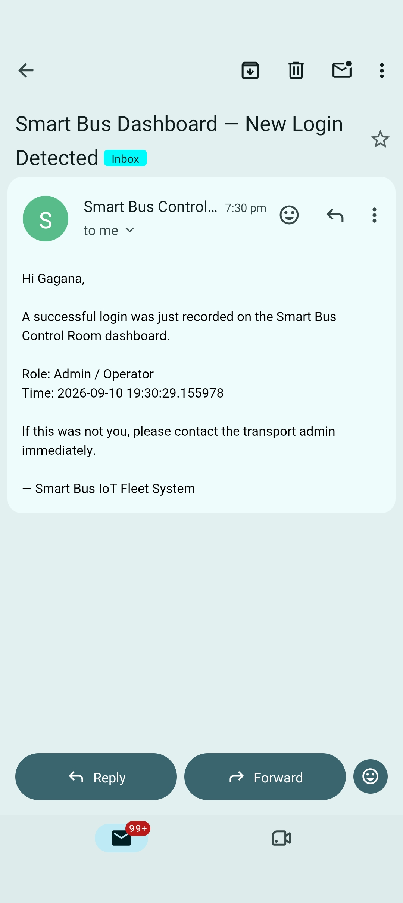 |
| *Admin & passenger sign in* | *Self-registration with RFID card UID* | *Security login alert email received on phone* |

### 2. Admin & Fleet Dashboard
| Admin Control Room | Commuter Directory | RFID Card Wallets |
| :---: | :---: | :---: |
| 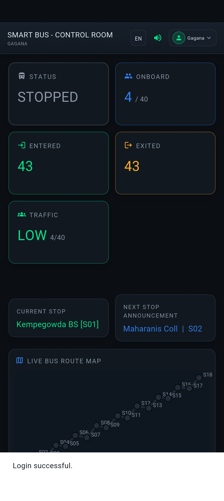 | 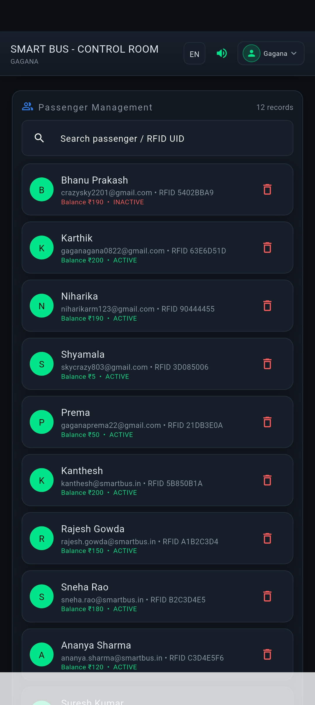 | 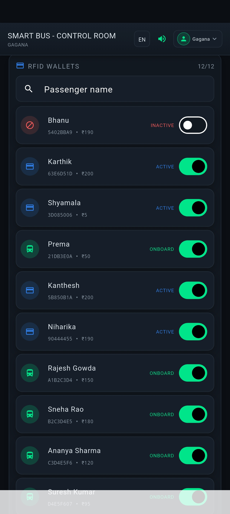 |
| *Current stop, occupancy (4/40), and traffic status* | *Searchable passenger list with balances* | *Active RFID cards and balance monitoring* |

### 3. Passenger Experience & Route Map
| Passenger Dashboard | Live Route Map | Journey & Fare History |
| :---: | :---: | :---: |
| 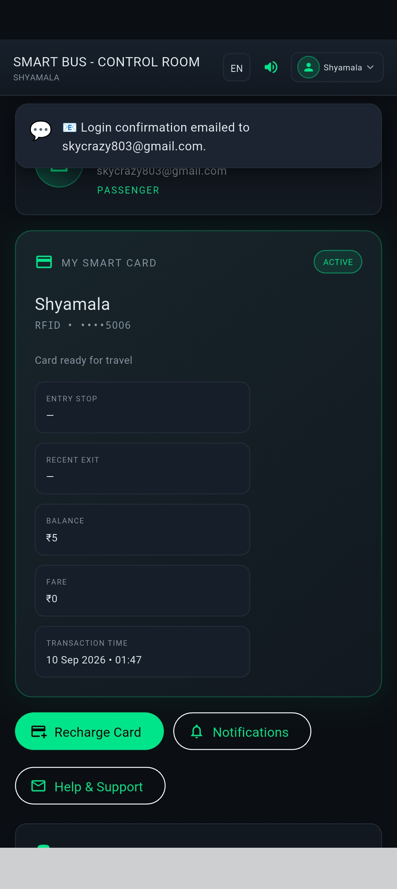 | 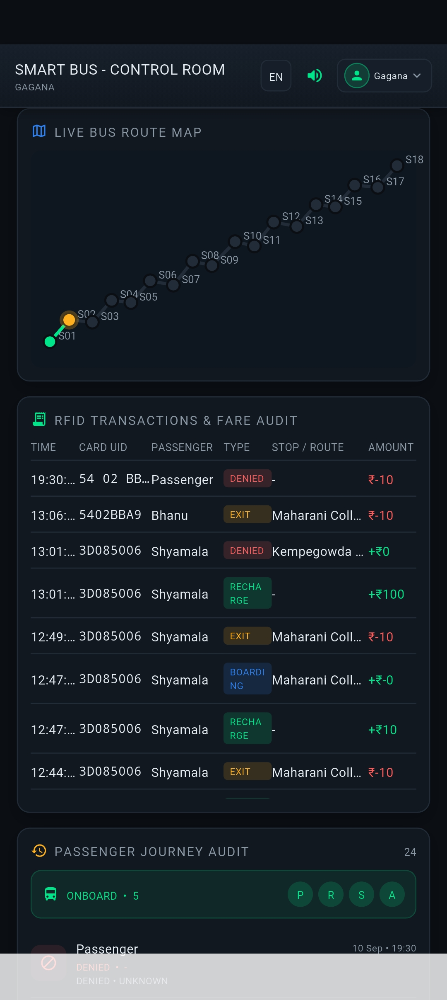 | 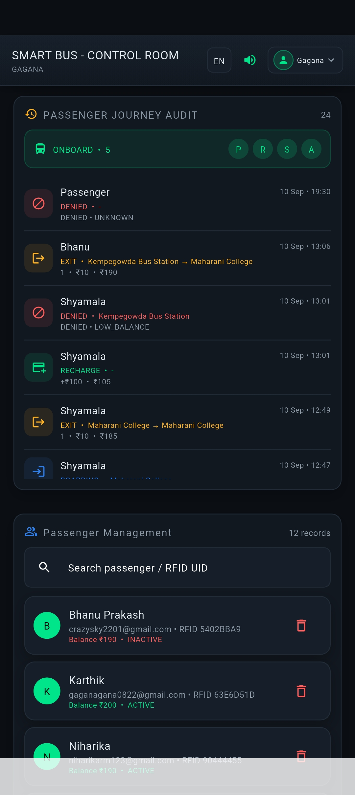 |
| *Card balance, UID, and lock/unlock toggle* | *Simulated route across 18 Bengaluru stops* | *Trip records with boarding and exit fare details* |

### 4. Regional Bilingual Interface (Kannada - ಕನ್ನಡ ಇಂಟರ್ಫೇಸ್)
| ಕನ್ನಡ ಡ್ಯಾಶ್‌ಬೋರ್ಡ್ | ಲೈವ್ ಬಸ್ ಸ್ಥಿತಿ | ಬಿಎಂಟಿಸಿ ಮಾರ್ಗ ಸಹಾಯಕಿ |
| :---: | :---: | :---: |
| 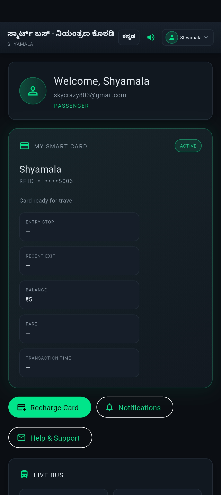 | 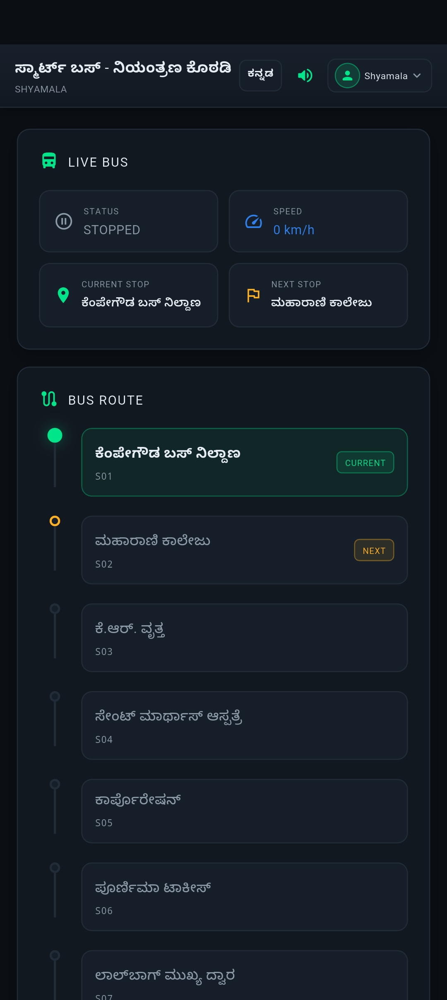 | 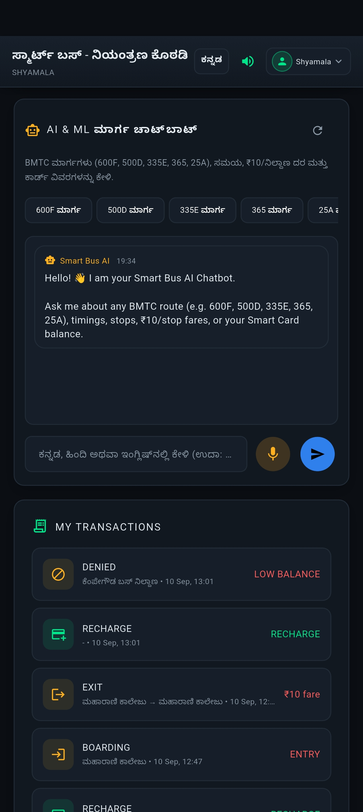 |
| *ಕನ್ನಡ ಸ್ಥಳೀಕರಣ: ಕಾರ್ಡ್ ವಿವರಗಳು ಮತ್ತು ಬ್ಯಾಲೆನ್ಸ್* | *ಪ್ರಸ್ತುತ ನಿಲ್ದಾಣ, ವೇಗ ಮತ್ತು ಮುಂದಿನ ನಿಲ್ದಾಣ* | *ಬಿಎಂಟಿಸಿ ಬಸ್ ಮಾರ್ಗಗಳ ಮಾಹಿತಿ (600F, 500D)* |

### 5. Wallet Recharge & Hardware Setup
| Razorpay Payment (Test Mode) | Recharge Success SMS | Hardware Prototype Rig |
| :---: | :---: | :---: |
| 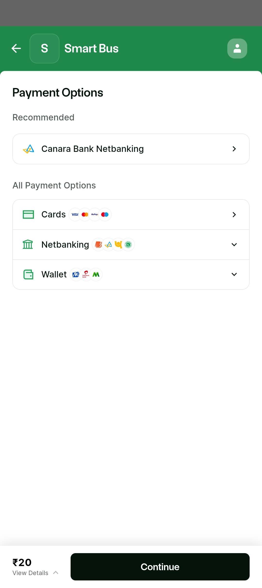 | 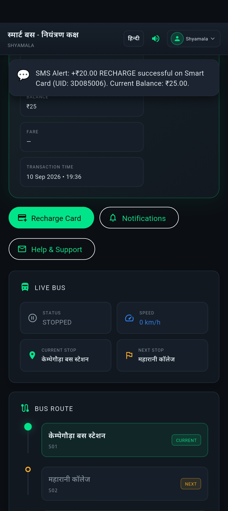 | 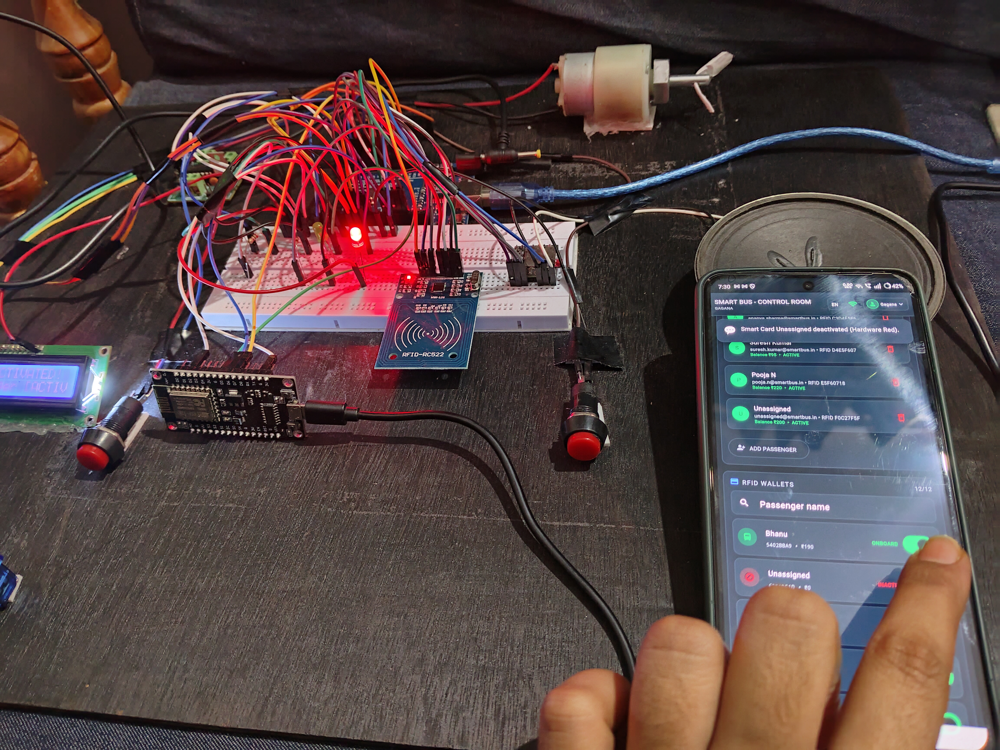 |
| *Test recharge via UPI, Netbanking, Cards* | *In-app notification confirming recharge* | *Integrated Arduino, NodeMCU, and turnstile rig* |

---

## Hardware Pinout Summary

* **Arduino UNO:**
  * RFID Reader: D9 (RST), D10 (SDA), D11 (MOSI), D12 (MISO), D13 (SCK), 3.3V Power
  * DFPlayer Mini: D2 (TX via 1kΩ resistor), D3 (RX)
  * Servos: D4 (Entry Gate), A3 (Exit Gate)
  * Telemetry Output: Pin A2 (TX to NodeMCU through 1kΩ/2kΩ voltage divider)
  * Reverse Link: Pin A3 (RX from NodeMCU D7)
  * 16x2 LCD: A4 (SDA), A5 (SCL)
* **NodeMCU ESP8266:**
  * Telemetry Input: Pin D2 (RX from Arduino A2 via divider)
  * Reverse Signal: Pin D7 (TX to Arduino A3)
  * Indicators: Pin D5 (Green LED), Pin D6 (Red LED)

For full wiring schematics, read [`Circuit/Pinout_and_Wiring_Guide.md`](Circuit/Pinout_and_Wiring_Guide.md).

---

## How to Run the Code

### 1. Flutter Mobile Application
```bash
# Navigate to the Flutter app directory
cd Main-Project/Smart-Bus-IoT-Fare-Collection/Flutter-App

# Install packages
flutter pub get

# Generate localization files
flutter gen-l10n

# Run the app on your phone or emulator
flutter run
```

### 2. Flashing Hardware Firmware
1. Open [`Arduino/SmartBus_Arduino_Firmware.ino`](Arduino/SmartBus_Arduino_Firmware.ino) in the Arduino IDE. Select **Board: Arduino Uno**, choose the COM port, and upload.
2. Open [`Arduino/SmartBus_NodeMCU_Firmware.ino`](Arduino/SmartBus_NodeMCU_Firmware.ino). Update `WIFI_SSID` and `WIFI_PASSWORD` with your local Wi-Fi credentials. Select **Board: NodeMCU 1.0 (ESP-12E Module)**, choose the COM port, and upload.

---

## What I Learned

* How to safely connect 5V Arduino logic with 3.3V ESP8266 logic using a voltage divider.
* Structuring a Flutter application using Provider for clean state management across multiple screens.
* Implementing bilingual localization in Flutter using `.arb` translation files for English and Kannada.
* Running an embedded HTTP server inside a mobile application to listen for local IoT events.

---

## Project Documentation

The complete academic thesis report submitted for my MCA Major Project is available in [`Documentation/Smart_Bus_Major_Project_Report.docx`](Documentation/Smart_Bus_Major_Project_Report.docx).
