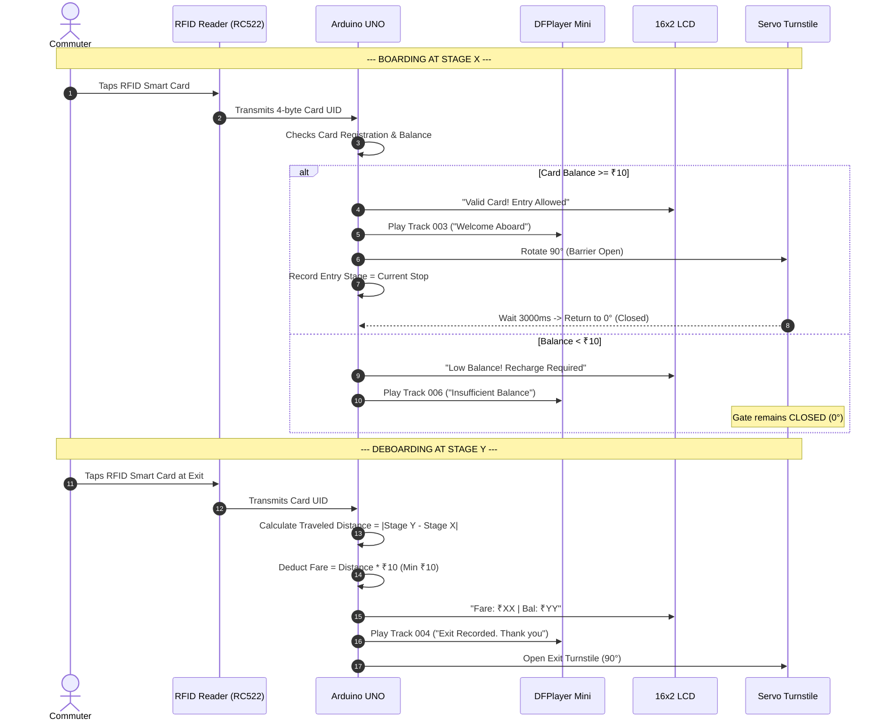
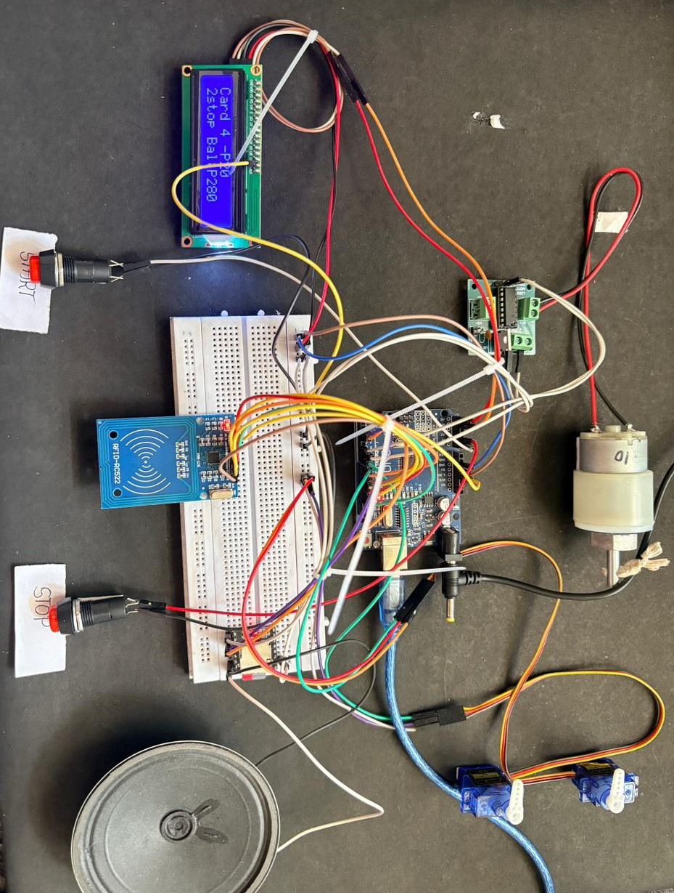
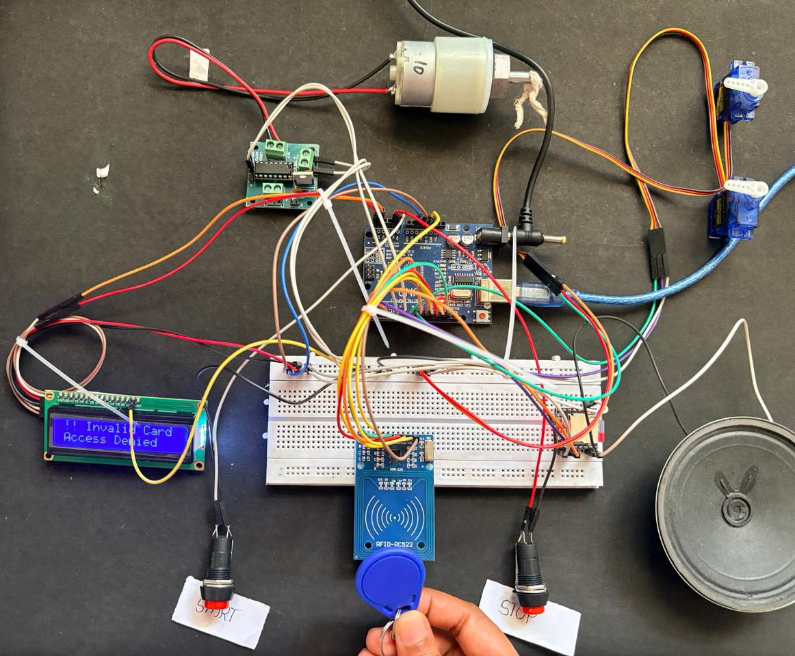

# Automatic Fare Collection System with Voice Alert

[](https://arduino.cc)
[](https://isocpp.org)
[](#hardware-components)
[](#hardware-components)

> **MCA Minor Project Report & Implementation**  
> **Student:** Gagana C P (Reg No. P18MC22S0012)  
> **Department:** Master of Computer Applications  
> **Institution:** Community Institute of Management Studies, Bengaluru (Affiliated to Bengaluru City University)

---

## 1. Problem Statement & Objectives

Traditional public transit fare collection relies heavily on physical cash exchange and manual paper ticketing handled by onboard conductors. This process causes severe boarding bottlenecks, revenue leakage, counterfeit ticketing, and disputes over loose coin change during peak transit hours.

### Objectives
1. **Automate Fare Collection:** Implement contactless 13.56 MHz RFID smart card scanning for instantaneous commuter entry and exit.
2. **Dynamic Stage-Based Fare Calculation:** Compute fares automatically based on traveled distance between boarding stop and destination stop ($Fare = N 	imes ₹10$, minimum $₹10$).
3. **Turnstile Barrier Gate Automation:** Control physical entry and exit barrier arms using SG90 micro-servos to physically prevent unpaid boarding.
4. **Instant Audio Annunciation:** Provide real-time voice feedback using the DFPlayer Mini module to guide visually impaired commuters and improve commuter confidence.
5. **Clear Visual Status:** Display account balance, stage numbers, and error alerts on a high-contrast 16x2 I2C LCD screen.

---

## 2. Hardware Architecture & Components

| Component | Model / Spec | Purpose in System |
| :--- | :--- | :--- |
| **Microcontroller** | Arduino UNO (ATmega328P) | Central processing unit executing fare logic, card memory checking, and peripheral timing. |
| **RFID Reader** | RC522 (13.56 MHz SPI) | Reads 4-byte / 7-byte Unique Identifiers (UID) from commuter RFID cards and keyfobs. |
| **Audio Annunciator**| DFPlayer Mini + 3W Speaker | Decodes FAT16/FAT32 MP3 audio tracks triggered over UART (SoftwareSerial). |
| **Visual Display** | 16x2 Character LCD with I2C (PCF8574)| Displays welcoming text, commuter name, stop number, fare debited, and remaining balance. |
| **Gate Barriers** | 2x SG90 Micro Servos | Actuates mechanical turnstile arms (0° closed, 90° open for 3 seconds upon valid tap). |
| **Motor Drive** | L293D Dual H-Bridge + DC Motor | Simulates bus transit motion between simulated bus stops. |
| **Push Buttons** | 2x Tactile Buttons (A0, A1) | Triggers bus START movement and STOP stage incrementation. |

---

## 3. Circuit Wiring & Pinout

```text
Arduino Pin       Peripheral Pin       Function
─────────────────────────────────────────────────────────
3.3V              RFID VCC             3.3V Power (Do NOT connect to 5V!)
GND               System Ground        Common system ground
D2                DFPlayer RX          Audio SoftwareSerial TX (via 1kΩ)
D3                DFPlayer TX          Audio SoftwareSerial RX
D4                Servo 1 (Entry Gate) PWM signal (0° to 90°)
D5                L293D IN1            DC Motor forward direction
D6                L293D IN2            DC Motor stop / reverse
D9                RFID RST             SPI Reset
D10               RFID SDA / SS        SPI Chip Select
D11               RFID MOSI            SPI Master Out Slave In
D12               RFID MISO            SPI Master In Slave Out
D13               RFID SCK             SPI Serial Clock
A0                START Button         Pull-up input (Active LOW)
A1                STOP Button          Pull-up input (Active LOW)
A2                Servo 2 (Exit Gate)  PWM signal (0° to 90°)
A4                16x2 LCD SDA         I2C Serial Data
A5                16x2 LCD SCL         I2C Serial Clock
```

---

## 4. Ticketing & Fare Calculation Workflow



---

## 5. Physical Prototype Gallery

| Hardware Setup | Dual Barrier Turnstiles | Working Module Overview |
| :---: | :---: | :---: |
|  |  |  |
| *Breadboard wiring, Arduino UNO, and power rail* | *Servo gate barrier with RFID scanning zone* | *Integrated test rig displaying dynamic LCD status* |

---

## 6. Official Academic Documentation

The complete academic thesis report submitted in fulfillment of the MCA degree is preserved in [`Documentation/MCA_Minor_Project_Report.pdf`](Documentation/MCA_Minor_Project_Report.pdf).
